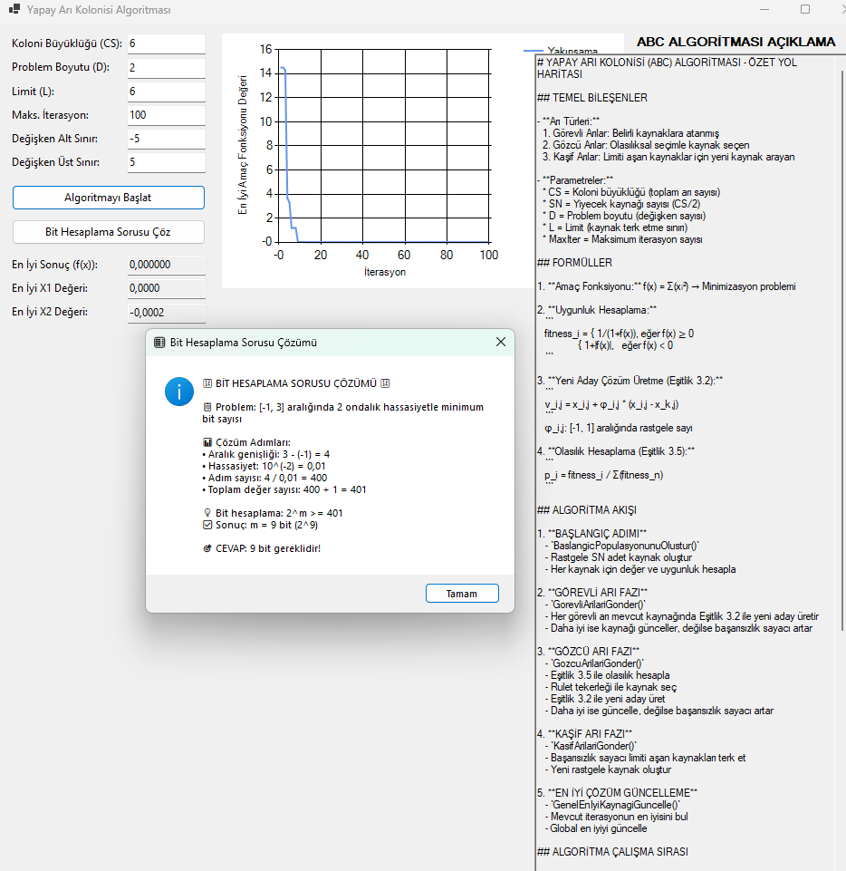

# 🐝 ABC Algorithm Implementation

🐝 **ABC Algorithm Implementation** - Interactive optimization solver using Artificial Bee Colony algorithm with real-time visualization and parameter tuning capabilities.

## Proje Açıklaması
Yapay Arı Kolonisi (ABC) algoritmasını kullanarak optimizasyon problemlerini çözen interaktif masaüstü uygulaması. Uygulama, görevli arılar, gözcü arılar ve kaşif arılar olmak üzere üç farklı arı türünün davranışlarını simüle ederek matematiksel fonksiyonların minimum değerlerini bulur. Kullanıcı dostu arayüz ile algoritma parametrelerini ayarlayabilir, çözüm sürecini gerçek zamanlı grafiklerle takip edebilir ve sonuçları görselleştirebilirsiniz. Ayrıca optimizasyon problemlerinde kullanılan bit hesaplama çözümleyicisi de içerir.

## Project Description
An interactive desktop application that solves optimization problems using the Artificial Bee Colony (ABC) algorithm. The application finds the minimum values of mathematical functions by simulating the behavior of three different bee species: employed bees, onlooker bees, and scout bees. With the user-friendly interface, you can configure algorithm parameters, monitor the solution process with real-time graphs, and visualize the results. It also includes a bit-calculation solver used in optimization problems.

**Technologies:** C#, .NET 8.0, Windows Forms, Chart Controls
